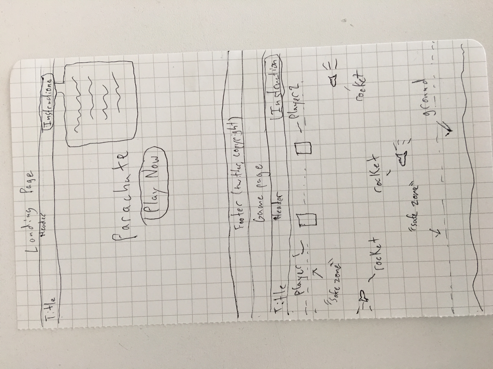

# Easy Company

# [Link to my Trello](https://trello.com/b/3MgGS7wO/parachute-project-1)

#Game Name: Easy Company

# Concept:
#### Easy Company is a cooperative, obstacle evasion game akin to old school Frogger. In Easy Company, two paratroopers are dropped over enemy territory and must evade incoming anti-troop fire using only side to side movements as gravity slowly brings them to the ground.  

## No Trooper Left Behind
#### If one player is lost, the Team as a whole loses. Using communication and teamwork, both players must evade incoming fire by strafing right and left out of harms way until both troopers land safely on the ground.

## Applications Used
 - Jquery 
 - CSS
 -HTML
 -JavaScript
 -Lots of Caffeine
 -Breakfast Burritos for Breakfast/Lunch/Dinner

## Controls
### Player 1:
#### Move left: "A" key
#### Move right: "D" key

### Player 2:
#### Move left: "J" key
#### Move right: "L" key

### As a Team:
#### Players cannot overlap, necessitating effective communication to strafe and avoid incoming fire. Remember: No trooper left behind! 

## March 27th, 2017 
#### - Dear diary, today I start my mission to construct my first(ish) game. My goal between now and midday tomorrow is to animate my player divs to recreate "gravity" as the players parachute down, and to create a function that allows players to move side to side while parachuting. I SHOULD take that time to create a function that shoots random div "rockets" from both sides of the screen, but I need to test that the gravity animation and player controls work together first. This will likely bite me in the ass later: I will report back.

### Today's Successes
#### Got "players" to float down constantly, and move side to side based on player input. Created "gravity" and player input faster than I thought I would - beat my mid-day tomorrow goal.

### Today's Issues
#### - Git Hub gave me a commit conflict error, but I figured it out with git pull, git fetch, and git merge.
 - Players can overlap, and leave div due to absolute positioning. Unsure how to solve.

 ## March 28th, 2017
 #### - Dear diary, as promised, I'm reporting back. Lucky for me, getting the gravity animations and player controls working in tandem did NOT bite me in the ass. All good. Today my main goal has been to start the lengthy process of establishing collision between players, and hopefully get some "rockets" firing (in reality they will just be divs with the word Rocket soaring through space time)

 ### Today's Successes
 #### "Rockets" are go!

 ### Today's Issues
 #### Took way more time than I anticipated, but all is well. Tomorrow is another day. 

 ## March 29th, 2018
 #### As you can tell by my incorrect labeling of the year, I am exhausted. My goal for today was to establish collision between rockets and players - it went less than well, but it went. I created 4+ ways of detecting collisions with rockets, and after 10 hours of hair pulling and self hatred I discovered that I had been calling the function in the wrong location. 11/10 Good day, would recommend. 

 ### Today's Successes
 ####  I did not fling myself from the top of the WeWork building during the lunch hour, and my self restraint paid off. At about 4pm I discovered that I was calling my (working) check for collision function in the wrong location. Go figure. During my last few hours I added a rocket explosion on collision and rocket imgs.

 ### Today's Catastrophic Failures
 #### Refer to the above paragraphs.

 ## March 30th, 2017
 #### Today I "finish" the game in the sense of a minimum viable product. I'm hoping that if I get past win condition/loss condition I can move onto a goal I've had since the beginning, which is to add a C47 drop plane that drops the players onto the battlefield. 

 ### Today's Successes
 #### MVP achieved! Also, stretch goal achieved! The C47 troop dropoff is working, and I have implemented win/lose conditions. Woo!

### Today's Issues
#### A few stling issues to solve, but other than that, nothing MAJOR.s

## UNSOLVED PROBLEMS
#### Players can leave gamboard

#### Player 2 can push player one, but not vica versa

#### After one player death, the other player can't be blown up

#### Janky reset - is actually just page reload.

