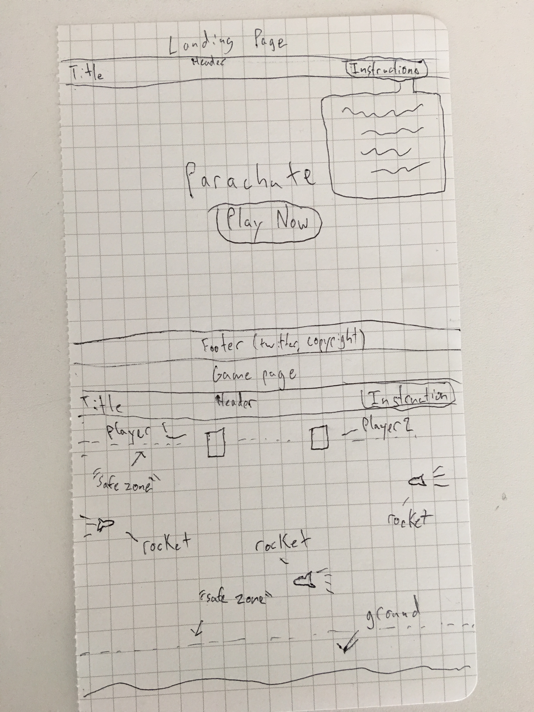

# Parachute

# [Link to my Trello](https://trello.com/b/3MgGS7wO/parachute-project-1)

<<<<<<< HEAD

#Game Name: Easy Company

# Concept:
#### Easy Company is a cooperative, obstacle evasion game akin to old school Frogger. In Easy Company, two paratroopers are dropped over enemy territory and must evade incoming anti-troop fire using only side to side movements as gravity slowly brings them to the ground.  

## No Trooper Left Behind
#### If one player is lost, the Team as a whole loses. Using communication and teamwork, both players must evade incoming fire by strafing right and left out of harms way until both troopers land safely on the ground.

## Controls
### Player 1:
#### Move left: "A" key
#### Move right: "D" key

### Player 2:
#### Move left: "left arrow" key
#### Move right: "right arrow" key

### As a Team:
#### Players cannot overlap, necessitating effective communication to strafe and avoid incoming fire. Remember: No trooper left behind! 
=======

>>>>>>> 7b0480476bf1221e23b177cb452367bde65f657f
